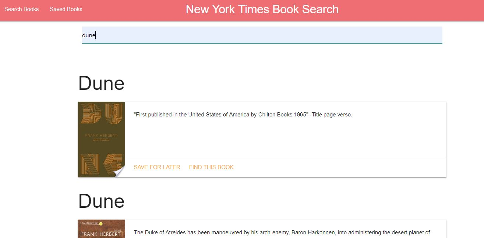
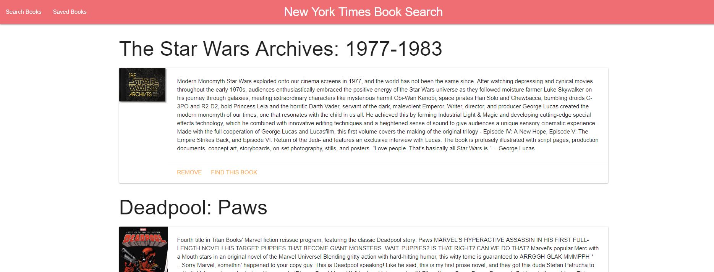

# Google Book Search Application

- - -
## About This App

View this app live <a href="https://floating-forest-39889.herokuapp.com/">here!</a>
- - -

This app utilizes the GoogleBooks API to find books from accross the web.
After finding the book that you like, you can Save it for later.

Once you have compiled your reading list, click on the Saved Books link at the top to view your compiled reading list.

From here you can view your books on Google, or remove them from your list.

- - -
## Built by Robert Anderson Using...
- MongoDB
- Express.js
- ReactJS
- NodeJS
